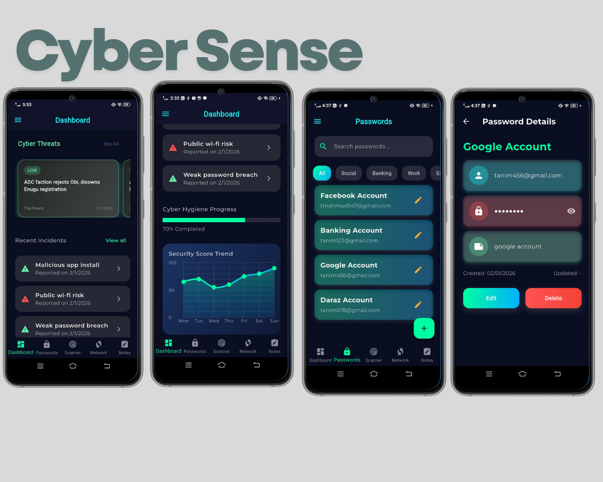

🔐 Cyber Sense Plus

All-in-One Personal Cybersecurity & Digital Safety App

Cyber Sense Plus is a premium, privacy-focused cybersecurity mobile application built with Flutter.
It helps users secure passwords, protect sensitive notes, monitor breaches, scan threats, analyze network safety, and build better cyber hygiene habits — all in one modern, dark-themed, user-friendly app.

🚀 Key Highlights

🔒 Security-first architecture

🌙 Premium dark UI (fully custom & polished)

📊 Real-time security score & trend analytics

🛡️ Local encryption + PIN-protected vault

☁️ Firebase-powered authentication & sync

📱 Cross-platform Flutter app

🧠 Core Features
🔐 Password Vault & Secure Notes

AES-256 encrypted password manager

Secure notes for sensitive information

PIN-based lock to access vault & notes

Local encryption (no plain-text storage)

📊 Digital Risk Dashboard

Unified dashboard showing:

Security score

Password strength overview

Breach exposure

Network safety status

Trend graphs to visualize security improvement over time

🚨 Breach Monitoring

Monitor data breaches related to user accounts

Detailed breach insights & risk level

Breach history tracking

🕵️ Threat Detection

🌐 URL scanner – detect malicious or unsafe links

📷 QR code scanner – verify safety before opening

Instant scan results with risk indicators

📡 Network Safety & Wi-Fi Analysis

Scan connected Wi-Fi network

View:

Signal strength
Network details
Speed test results
Detect potentially unsafe networks

🧩 Cyber Hygiene & Awareness

Security tips & best practices
Quizzes to test cybersecurity knowledge
Achievement badges for good cyber habits

📰 Cyber Threat News

Latest cybersecurity threats & updates
Curated news feed inside the app

📝 Incident Logbook

Log cybersecurity incidents manually
Add incident details & notes
Review past incidents anytime

👤 User Profile & Settings

User profile management
Edit profile details
Change PIN
Delete account
Logout securely
Privacy Policy & About App pages
Help & Support section

🎨 UI / UX Design

Fully custom dark premium theme
Modern Material-inspired UI
Smooth onboarding & splash experience

Custom:

Sidebar (Drawer)
Bottom navigation bar
Cards, charts, buttons, inputs

📱 Onboarding Experience

Custom splash & intro screens explaining the app vision:

{
  "Digital Risk Profile": "Track your security score, breach exposure, and network safety.",
  "Secure Vault": "AES-256 encrypted passwords & secure notes with biometric/PIN protection.",
  "Threat Detection & Cyber Hygiene": "Scan URLs, QR codes, monitor breaches & improve habits."
}

## Screenshots

### 🔐 Password Vault & Secure Notes

Secure storage with AES-256 encryption and PIN protection.

### 📊 Digital Risk Dashboard

Shows security score, password strength, breach exposure, and trends.

### 🕵️ Threat Detection

Scan URLs & QR codes, get instant risk results.

### 📡 Network Safety

Analyze connected Wi-Fi networks, speed tests, and risks.

### 🎨 UI / UX

Premium dark theme, modern Material-inspired UI, smooth onboarding.

🏗️ Project Architecture

The app follows a feature-based clean architecture:

lib/
├── core/          # Constants, utils, themes, reusable widgets
├── features/      # Feature-wise modules (auth, vault, scanner, dashboard, etc.)
├── services/      # Firebase, encryption, storage, network services
├── models/        # Data models
├── providers/     # State management (Provider)
├── routes/        # App routing
├── widgets/       # Shared UI components

This ensures:

Scalability

Maintainability

Clear separation of concerns

🔧 Tech Stack
Layer	Technology
Framework	Flutter (Dart)
State Management	Provider
Backend	Firebase
Database	Cloud Firestore
Authentication	Firebase Auth
Encryption	AES-256 (local)
Charts	FL Chart
Network	Wi-Fi & Speed APIs
UI	Custom Material Widgets
🔐 Security & Privacy

❌ No passwords stored in plain text

🔒 Local AES-256 encryption for vault & notes

🔑 PIN-protected sensitive sections

🚫 Firebase credentials & secrets excluded from repo

🧼 Secure logout & account deletion flow

User privacy is a top priority.

⚠️ Important Notes

google-services.json is not included for security reasons

Firebase configuration must be added manually

Keystore files are excluded from version control

🛠️ Setup Instructions
git clone https://github.com/<your-username>/cyber-sense-plus.git
cd cyber-sense-plus
flutter pub get
flutter run

Make sure Firebase is configured before running.

📌 Repository Status

🔒 Private repository (recommended)

🚀 Actively developed

📱 Production-ready architecture

👨‍💻 Author

Tanim Mahmud
Flutter Developer | Cybersecurity-focused App Builder
